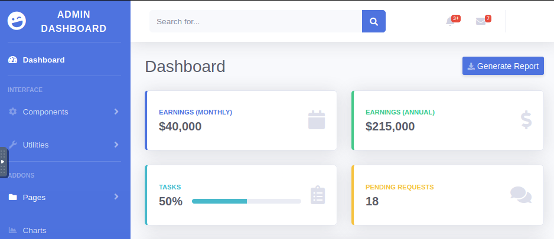
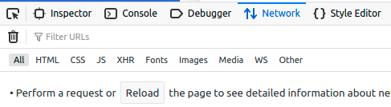
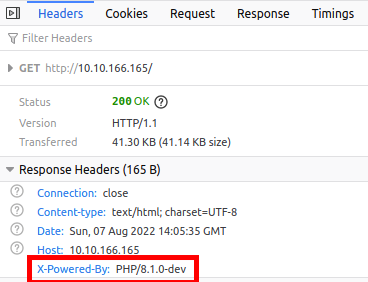
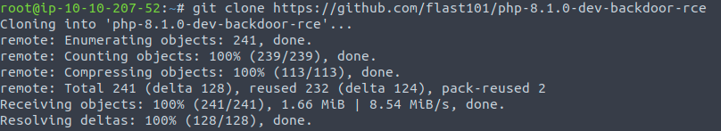
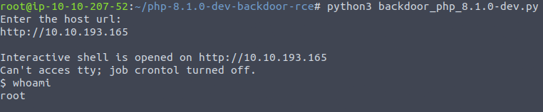
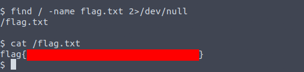

# Agent T


Something seems a little off with the server. 

LINK = [https://tryhackme.com/room/agentt](https://tryhackme.com/room/agentt)

### FYI
This writeup don't include any passwords/cracked hashes/flags

# Description

Agent T uncovered this website, which looks innocent enough, but something seems off about how the server responds...

After deploying the vulnerable machine attached to this task, please wait a couple of minutes for it to respond.


# Steps

1 - Join the room, start the virtual machine and the AttackBox (or connect via VPN)

2 - Access the IP address of the virtual machine



3 - Open the "Web Developer" tools in the browser and go to the Network tab



4 - Reload the website and search the first GET request to the file ```/```

5 - Check the response headers and notice that the website is using ```PHP/8.1.0-dev```



6 - Search "php/8.1.0-dev exploit" which will lead you to this repository
* https://github.com/flast101/php-8.1.0-dev-backdoor-rce

7 - Clone the repository
* ```git clone https://github.com/flast101/php-8.1.0-dev-backdoor-rce```



8 - Excecute the exploit and enter the IP address of the virtual machine to get root access
* ```python3 backdoor_php_8.1.0-dev.py```



9 - Find the flag file
* ```find / -name flag.txt 2>/dev/null```



10 - Get the flag!! 😎
