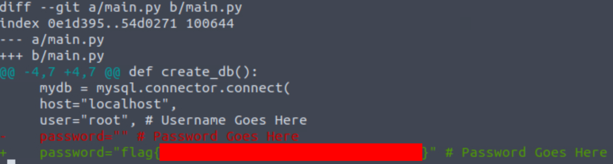

# Committed


One of our developers accidentally committed some sensitive code to our GitHub repository. Well, at least, that is what they told us...

LINK = [https://tryhackme.com/room/committed](https://tryhackme.com/room/committed)

### FYI
This writeup don't include any passwords/cracked hashes/flags

# Description

Oh no, not again! One of our developers accidentally committed some sensitive code to our GitHub repository. Well, at least, that is what they told us... the problem is, we don't remember what or where! Can you track down what we accidentally committed?

# Steps

1 - Join the room, start the virtual machine (or connect via VPN)

2 - Move to the location of the ```commited.zip``` file

* ```# cd /home/ubuntu/commited```

3 - Decomprese the zip file

* ```# unzip commited.zip```

4 - Move to the ```.git``` location and list all the branches

* ```# cd /commited/.git```
* ```# git branch```

5 - Once we have the branch name, lets get the logs of it

* ```# git log <branch-name>```

6 - Notice that one of the commits have a description ```Oops```(indicator that the developer made a mistake), copy commit ID from that branch and also copy the commit ID from the branch we were looking for at the beginning

7 - Search the difference between both commits
* ```# git diff <ID-from-the-first-commit> <ID-from-the-Oops-commit>```




8 - Get the flag!! 😎
