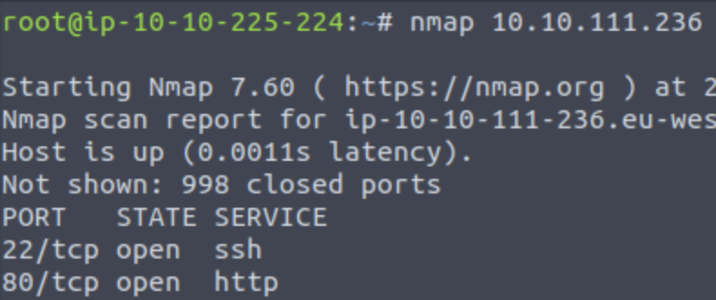

# Pickle Rick


A Rick and Morty CTF. Help turn Rick back into a human!

LINK = [https://tryhackme.com/room/picklerick](https://tryhackme.com/room/picklerick)

### FYI
This writeup don't include any passwords/cracked hashes/flags

## Description

This Rick and Morty themed challenge requires you to exploit a webserver to find 3 ingredients that will help Rick make his potion to transform himself back into a human from a pickle.


## Steps

1 - Join the room, start the virtual machine and the AttackBox (or connect via VPN)

### What is the first ingredient Rick needs?
1 - Find open ports on the machine, the nmap output will show three open ports:
* ```# nmap <ip-virtual-machine>```



